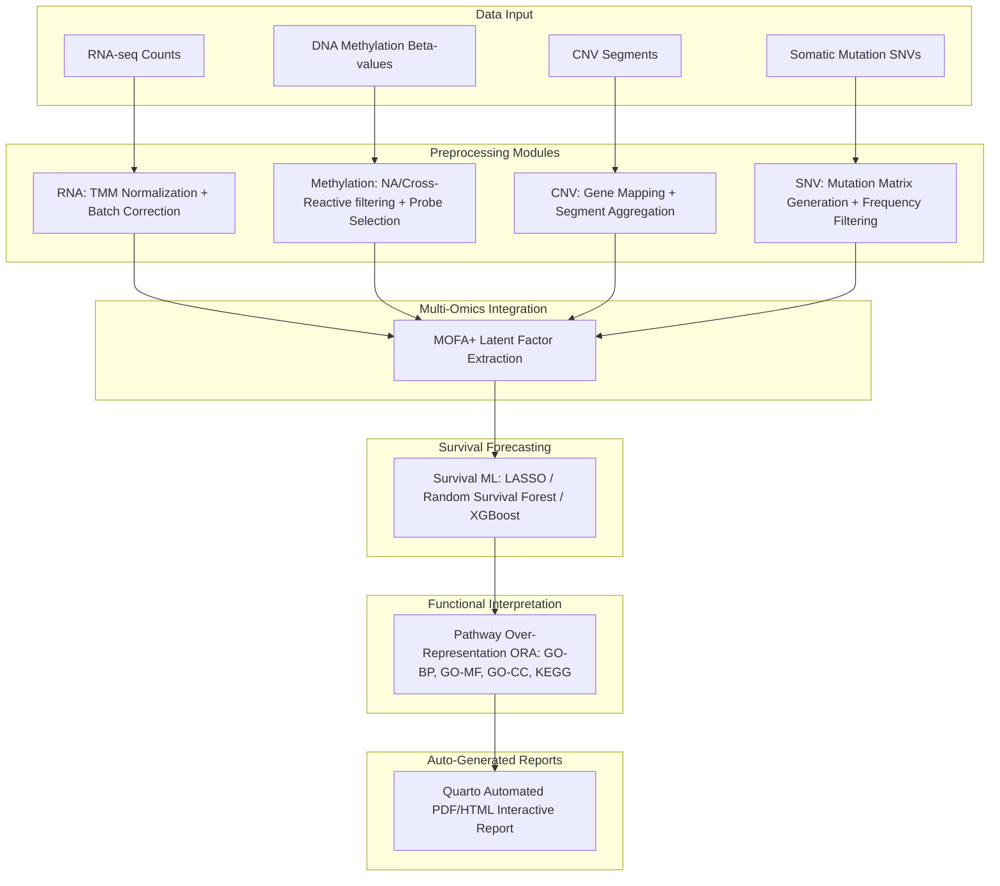

# OmicsFlow v1.1.0

[](https://nextflow.io/)
[](https://www.docker.com/)
[](https://conda.io/)
[](LICENSE)

OmicsFlow is a modular, parameterizable, and reproducible next-generation Nextflow orchestration pipeline designed for integrated multi-omics preprocessing, feature extraction, factorization, and downstream clinical survival forecasting on large-scale oncology datasets. It natively supports legacy TCGA/GDC cohorts as well as fully custom, metadata-driven external cohorts.

OmicsFlow coordinates the standardisation of heterogeneous molecular views—including transcriptomics (RNA-seq), epigenomics (DNA Methylation), copy number variations (CNV), and somatic mutations (SNV)—and applies advanced latent factor analysis (MOFA+) alongside machine learning survival models to predict clinical outcomes and identify targetable biological pathways.

---

## What's New in v1.1.0

- **Universal Metadata Layer:** Full support for custom external cohorts. Supply a `sample_metadata.csv` to seamlessly decouple the pipeline from TCGA-specific barcode assumptions.
- **Clinical Data Abstraction Layer:** Use `--clinical_map` to provide configurable mappings for survival time, event status, age, gender, and tumor stage from any clinical dataset.
- **Dynamic Report Generation:** The Quarto report template now auto-detects cohort types and methylation platforms, producing professional, cohort-agnostic summaries.
- **Custom Pathway Validation:** Provide custom enrichment keywords via `--validation_keywords` to validate biological signatures specific to your disease context.

---

## Pipeline Workflow

The complete analytical architecture is orchestrated as follows:



---

## Architecture Summary

- **Preprocessing:** Standardizes and normalizes raw inputs. RNA-seq undergoes TMM normalization and log2 CPM conversion; DNA Methylation receives robust probe-level filtering (NA, invariant, cross-reactive) and imputation; CNV segments are mapped to high-level gene matrices; SNV data is parsed into functionally filtered occurrence maps.
- **Integration:** Multi-Omics Factor Analysis (MOFA+) distills high-dimensional matrices into a low-dimensional space of interpretable latent factors capturing shared and modality-specific variance.
- **Machine Learning (ML):** Evaluates patient prognosis using LASSO Cox Regression, Random Survival Forests, and XGBoost on the extracted MOFA factors. Extracts the most prognostic features for downstream interpretation.
- **Enrichment:** Functional Pathway Over-Representation Analysis (ORA) maps highly prognostic features against Gene Ontology (BP, MF, CC) and KEGG databases to isolate biological mechanisms.
- **Reporting:** Automatically complies all module artifacts into a standalone, interactive Quarto HTML/PDF report complete with interactive Lightbox plots, Kaplan-Meier curves, and dynamic cohort analysis text.

---

## Supported Cohorts

OmicsFlow can process any cohort provided the required omics matrices, clinical data, and metadata mappings are supplied. Supported cohort types include:

- TCGA
- GDC-derived cohorts
- ICGC-style cohorts
- Local institutional cohorts
- Custom metadata-driven cohorts

---

## Installation & Prerequisites

To run OmicsFlow, ensure the following core utilities are installed on your host system:

- **Nextflow** (`>=22.10.0`)
- **Java** (`>=11`)
- **Docker** (recommended) or **Miniconda/Mamba**

### 1. Containerized Setup (Recommended)
Build the stable release image locally:
```bash
# Clone the repository
git clone https://github.com/Abdullah-I-Ali/omicsflow.git
cd omicsflow

# Build the Docker image
docker build -t omicsflow:1.1.0 .
```

### 2. Local Conda Setup (Alternative)
Create the environment containing R, Python, and the necessary bioinformatics packages:
```bash
conda env create -f envs/omicsflow.yml
conda activate omicsflow
```

---

## Running OmicsFlow

OmicsFlow executes standard pipelines with simplified CLI parameter flags, supporting both legacy TCGA execution and fully custom metadata-driven execution.

### Example A: TCGA Fallback Mode (Legacy)
If no metadata is provided, OmicsFlow automatically parses sample types, batches, and patient IDs directly from standard 12/15/28-character TCGA barcodes.

```bash
nextflow run main.nf \
  --rna "data/raw_rna.rds" \
  --meth "data/raw_meth.rds" \
  --cnv "data/raw_cnv.rds" \
  --snv "data/raw_snv.rds" \
  --clinical "data/tcga_clinical.tsv" \
  --cross_react "configs/cross_reactive_probes.csv" \
  --gene_coords "configs/gene_coordinates.rds" \
  --outdir "results" \
  -profile docker
```

### Example B: Metadata-Driven Mode (Custom Cohorts)
For non-TCGA cohorts, supply a standardized `sample_metadata.csv` and an optional `clinical_map.json` to seamlessly integrate custom identifiers.

```bash
nextflow run main.nf \
  --rna "data/raw_rna.rds" \
  --meth "data/raw_meth.rds" \
  --cnv "data/raw_cnv.rds" \
  --snv "data/raw_snv.rds" \
  --clinical "data/custom_clinical.tsv" \
  --metadata "data/sample_metadata.csv" \
  --clinical_map "configs/clinical_map.json" \
  --cross_react "configs/cross_reactive_probes.csv" \
  --gene_coords "configs/gene_coordinates.rds" \
  --outdir "results" \
  -profile docker
```

---

## Metadata Schema Example

Provide a minimal example `sample_metadata.csv`:

```csv
sample_id,patient_id,sample_class,batch,center
RNA_001,P001,Tumor,B1,SiteA
RNA_002,P002,Tumor,B1,SiteA
```

- **sample_id**: unique molecular sample identifier
- **patient_id**: patient identifier used for cross-omics matching
- **sample_class**: user-defined sample grouping
- **batch**: technical batch variable
- **center**: optional collection center

---

## Output Directory Structure

Upon completion, all standardized results, plots, metadata, and HTML logs are populated in the specified output directory:

```text
results/
├── rna/                    # Standardized transcriptomic expression matrices & batch-correction diagnostics
│   ├── preprocess_rna.rds
│   └── plots/              # CPM density plots & PCA alignments (Before vs. After correction)
├── methylation/            # Filtered probe levels & high-variance epigenomic matrices
│   ├── preprocess_meth.rds
│   └── plots/              # Beta-value density profiles
├── cnv/                    # Aggregated gene-level copy number levels
│   └── preprocess_cnv.rds
├── snv/                    # Clean mutation occurrence grids & cohort frequency stats
│   ├── preprocess_snv.rds
│   └── plots/              # Mutation frequency & oncoplot visualization
├── integration/            # Trained MOFA+ model, latent factor weights, and variance maps
│   ├── mofa_model.rds
│   └── plots/              # Variance explained & factor correlation heatmaps
├── ml/                     # Survival model outputs, validation statistics, & biomarkers
│   ├── ml_results.rds      # Fitted survival models & cross-validation metrics
│   └── plots/              # Kaplan-Meier curves & biomarker feature-importance rank
├── enrichment/             # Functional pathway mapping & database matches
│   ├── go_bp_results.csv   # Enriched GO Biological Process terms (FDR ≤ 0.05)
│   ├── kegg_results.csv    # Enriched KEGG Pathway terms (FDR ≤ 0.05)
│   └── plots/              # Gene-concept network (cnetplot) & Enrichment Map (emapplot)
└── reports/                # Production release reports
    ├── OmicsFlow_Report.qmd
    └── OmicsFlow_Report.html # Standalone interactive publication-ready HTML report
```

---

## Reproducibility & Stability

OmicsFlow v1.1.0 enforces strict computational reproducibility:
1. **Version Locking:** Core packages are frozen within [envs/omicsflow.yml](envs/omicsflow.yml) and the corresponding container registry.
2. **Fixed Random Seeds:** Pipelines and downstream modules (MOFA+ factor initialization, train/test cross-validation folds, and Random Survival Forest simulations) use identical hardcoded seeds to guarantee bitwise consistency across runs.
3. **Execution Portability:** Separation of workflow logic (Nextflow) from computational runtime (Docker/Singularity/Conda) ensures identical results on standalone laptops, local workstations, and distributed SLURM clusters.

---

## Example Report Previews

Example report screenshots and interactive figures are available directly within the generated HTML report outputs.

---

## Citation & Reference

If you use OmicsFlow in your research, please cite this framework as follows:

```text
OmicsFlow: A Modular Nextflow Pipeline for Integrated Multi-Omics and Survival Forecasting
Version: v1.1.0 (Stable Release)
Author: Abdullah Ibrahim Ali
Year: 2026
Repository: https://github.com/Abdullah-I-Ali/omicsflow
```
