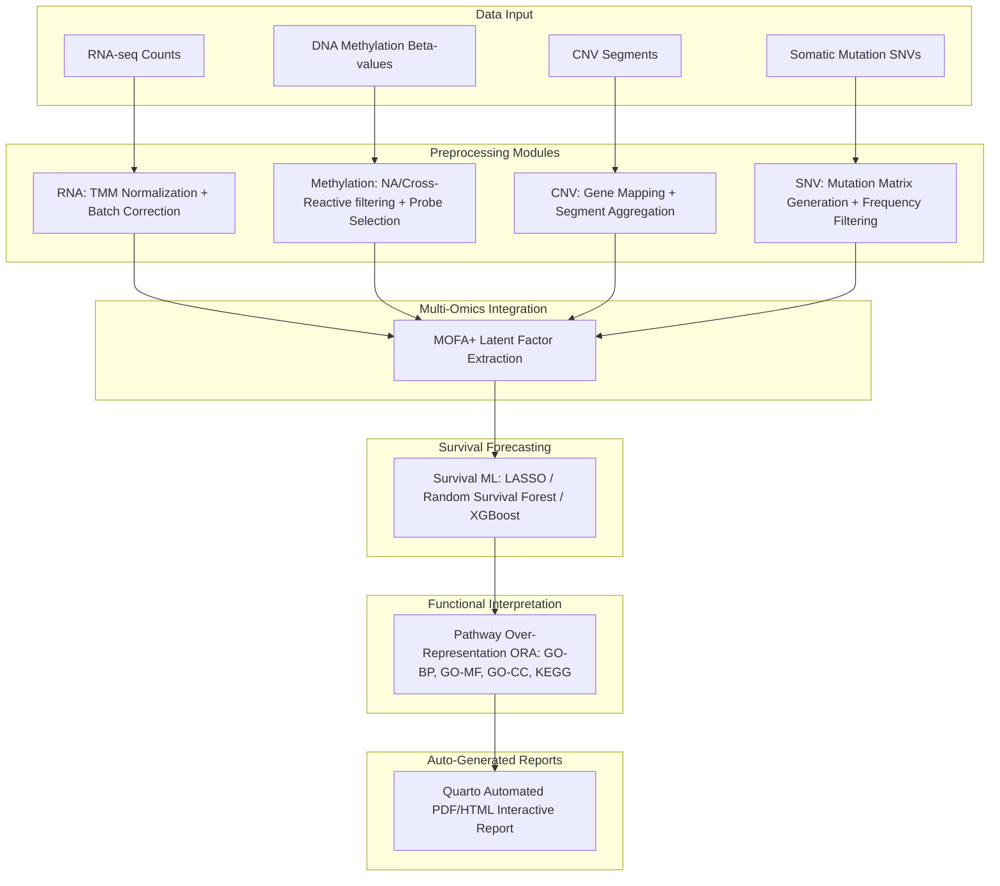

# OmicsFlow v1.0.0

[](https://nextflow.io/)
[](https://www.docker.com/)
[](https://conda.io/)
[](LICENSE)

OmicsFlow is a modular, parameterizable, and reproducible next-generation Nextflow orchestration pipeline designed for integrated multi-omics preprocessing, feature extraction, factorization, and downstream clinical survival forecasting on large-scale oncology datasets (e.g., TCGA/GDC cohorts).

OmicsFlow coordinates the standardisation of heterogeneous molecular views—including transcriptomics (RNA-seq), epigenomics (DNA Methylation), copy number variations (CNV), and somatic mutations (SNV)—and applies advanced latent factor analysis (MOFA+) alongside machine learning survival models to predict clinical outcomes and identify targetable biological pathways.

---

## Pipeline Workflow

The complete analytical architecture is orchestrated as follows:



---

## Core Features

- **✓ High-Performance RNA-Seq Preprocessing:** Automatic library size normalization (TMM), log2 CPM conversion, and batch effect correction using Limma.
- **✓ Scale-Aware Epigenomics Preprocessing:** Probe-level filtering (missingness, invariant CpG sites, and cross-reactive probe elimination) coupled with high-variance probe selection.
- **✓ Genomic Feature Mapping:** Translates segment-level CNV data to gene-level matrices, and formats raw mutation logs (SNVs) into binary occurrence maps.
- **✓ Multi-Omics Factorization (MOFA+):** Automatically runs multi-view factor analysis to extract shared and view-specific latent factors driving patient stratification.
- **✓ Machine Learning Survival Pipeline:** Compares LASSO Cox regression, Random Survival Forest, and Gradient Boosted Trees (XGBoost) using cross-validation to isolate highly prognostic features.
- **✓ Multi-Database ORA Enrichment:** Automatically performs functional pathway analysis across Gene Ontology (Biological Process, Molecular Function, Cellular Component) and KEGG databases.
- **✓ Automated Quarto Reporting:** Generates interactive, publication-ready HTML/PDF reports complete with sample QC, factor loading distributions, Kaplan-Meier stratification, and pathway network plots.
- **✓ Nextflow Orchestration:** Built-in parallel execution, error recovery, automatic retries, and comprehensive performance metrics.
- **✓ Dual Runtime Support:** Run anywhere using pre-configured Docker containers or local Conda virtual environments.

---

## Installation & Prerequisites

To run OmicsFlow, ensure the following core utilities are installed on your host system:

- **Nextflow** (`>=22.10.0`)
- **Java** (`>=11`)
- **Docker** (recommended) or **Miniconda/Mamba**

### 1. Containerized Setup (Recommended)
Build the stable release image locally:
```bash
# Clone the repository
git clone https://github.com/Abdullah-I-Ali/omicsflow.git
cd omicsflow

# Build the Docker image
docker build -t omicsflow:1.0.0 .
```

### 2. Local Conda Setup (Alternative)
Create the environment containing R, Python, and the necessary bioinformatics packages:
```bash
conda env create -f envs/omicsflow.yml
conda activate omicsflow
```

---

## Running OmicsFlow

OmicsFlow executes standard pipelines with simplified CLI parameter flags.

### Example Run (Docker Container Profile)
```bash
nextflow run main.nf \
  --rna "data/raw_rna.rds" \
  --meth "data/raw_meth.rds" \
  --cnv "data/raw_cnv.rds" \
  --snv "data/raw_snv.rds" \
  --clinical "data/clinical.tsv" \
  --cross_react "configs/cross_reactive_probes.csv" \
  --gene_coords "configs/gene_coordinates.rds" \
  --outdir "results" \
  -profile docker
```

### Example Run (Local Conda Profile)
```bash
nextflow run main.nf \
  --rna "data/raw_rna.rds" \
  --meth "data/raw_meth.rds" \
  --cnv "data/raw_cnv.rds" \
  --snv "data/raw_snv.rds" \
  --clinical "data/clinical.tsv" \
  --cross_react "configs/cross_reactive_probes.csv" \
  --gene_coords "configs/gene_coordinates.rds" \
  --outdir "results" \
  -profile conda
```

---

## Output Directory Structure

Upon completion, all standardized results, plots, metadata, and HTML logs are populated in the specified output directory:

```text
results/
├── rna/                    # Standardized transcriptomic expression matrices & batch-correction diagnostics
│   ├── preprocess_rna.rds
│   └── plots/              # CPM density plots & PCA alignments (Before vs. After correction)
├── methylation/            # Filtered probe levels & high-variance epigenomic matrices
│   ├── preprocess_meth.rds
│   └── plots/              # Beta-value density profiles
├── cnv/                    # Aggregated gene-level copy number levels
│   └── preprocess_cnv.rds
├── snv/                    # Clean mutation occurrence grids & cohort frequency stats
│   ├── preprocess_snv.rds
│   └── plots/              # Mutation frequency & oncoplot visualization
├── integration/            # Trained MOFA+ model, latent factor weights, and variance maps
│   ├── mofa_model.rds
│   └── plots/              # Variance explained & factor correlation heatmaps
├── ml/                     # Survival model outputs, validation statistics, & biomarkers
│   ├── ml_results.rds      # Fitted survival models & cross-validation metrics
│   └── plots/              # Kaplan-Meier curves & biomarker feature-importance rank
├── pathway/                # Functional pathway mapping & database matches
│   ├── go_bp_results.csv   # Enriched GO Biological Process terms (FDR ≤ 0.05)
│   ├── kegg_results.csv    # Enriched KEGG Pathway terms (FDR ≤ 0.05)
│   └── plots/              # Gene-concept network (cnetplot) & Enrichment Map (emapplot)
└── reports/                # Production release reports
    ├── OmicsFlow_Report.qmd
    └── OmicsFlow_Report.html # Standalone interactive publication-ready HTML report
```

---

## Reproducibility & Stability

OmicsFlow v1.0.0 enforces strict computational reproducibility:
1. **Version Locking:** Core packages are frozen within [envs/omicsflow.yml](envs/omicsflow.yml) and the corresponding container registry.
2. **Fixed Random Seeds:** Pipelines and downstream modules (MOFA+ factor initialization, train/test cross-validation folds, and Random Survival Forest simulations) use identical hardcoded seeds to guarantee bitwise consistency across runs.
3. **Execution Portability:** Separation of workflow logic (Nextflow) from computational runtime (Docker/Singularity/Conda) ensures identical results on standalone laptops, local workstations, and distributed SLURM clusters.

---

## Example Report Previews

Example report screenshots will be added in a future release.

---

## Citation & Reference

If you use OmicsFlow in your research, please cite this framework as follows:

```text
OmicsFlow: A Modular Nextflow Pipeline for Integrated Multi-Omics and Survival Forecasting
Version: v1.0.0 (Stable Release)
Author: Abdullah Ibrahim Ali
Year: 2026
Repository: https://github.com/Abdullah-I-Ali/omicsflow
```
