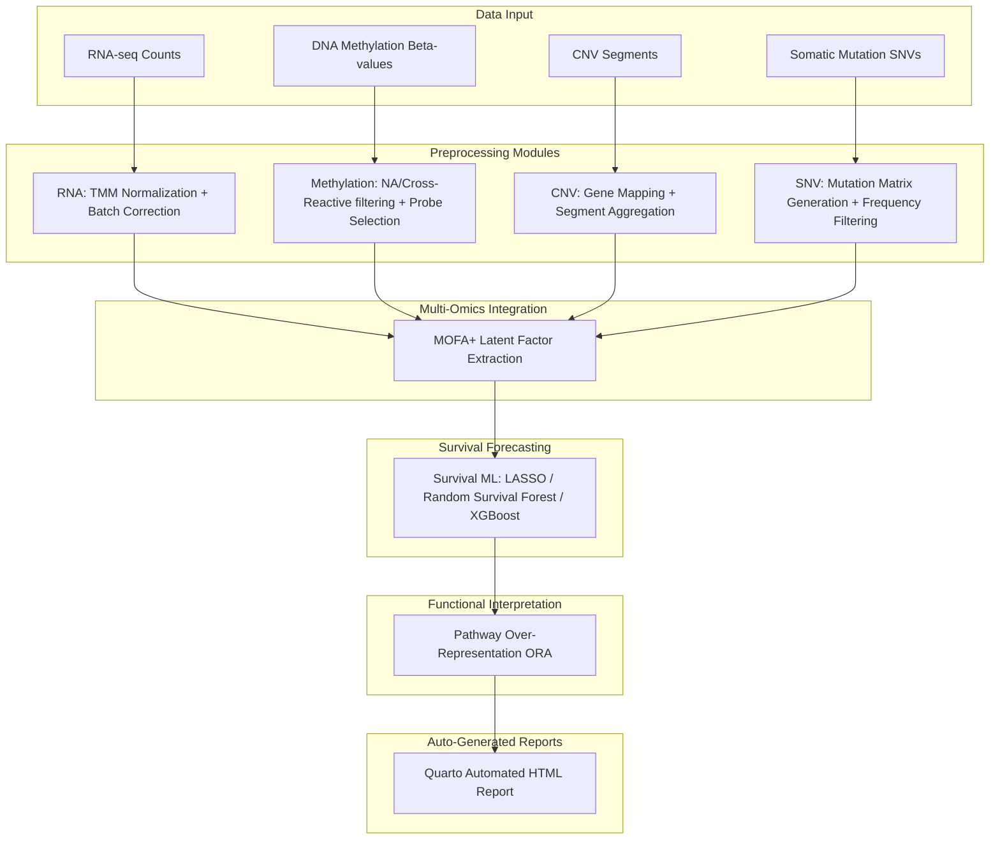

# OmicsFlow

[](https://nextflow.io/)
[](https://www.docker.com/)
[](https://quarto.org/)
[](LICENSE)

**OmicsFlow** is a modular, parameterizable, and reproducible orchestration pipeline designed for integrated multi-omics preprocessing, latent feature extraction, and downstream clinical survival forecasting. It seamlessly coordinates heterogeneous molecular views—including transcriptomics (RNA-seq), epigenomics (DNA Methylation), copy number variations (CNV), and somatic mutations (SNV)—and applies advanced Multi-Omics Factor Analysis (MOFA+) alongside machine learning survival models to predict clinical outcomes and isolate targetable biological pathways.

---

## 1. Key Features

- **Universal Metadata Abstraction Layer:** Full support for custom external cohorts. Supply a `sample_metadata.csv` to seamlessly decouple the pipeline from specific institutional or legacy barcode assumptions.
- **Realistic Cohort Generation:** Generates synthetic, biologically realistic cohorts embedding ground-truth pathway signals (e.g., Cell Cycle, ECM Organization) and survival stratification for robust pipeline validation.
- **Multi-Omics Integration (MOFA+):** Disentangles high-dimensional matrices into a low-dimensional space of interpretable latent factors capturing shared and modality-specific variance.
- **Machine Learning Survival Modeling:** Employs LASSO Cox Regression, Random Survival Forests, and XGBoost to evaluate patient prognosis based on multi-omics factors.
- **Automated Pathway Enrichment:** Maps highly prognostic omics features against Gene Ontology and KEGG databases to isolate critical biological mechanisms.
- **Automated HTML Reporting:** Compiles all modular artifacts into a standalone, interactive Quarto HTML report complete with interactive Lightbox plots, Kaplan-Meier curves, and dynamic cohort analyses.

---

## 2. Architecture Overview

The OmicsFlow analytical architecture is strictly modularized:



- **Preprocessing:** Standardizes and normalizes raw inputs. Eliminates technical batch effects and isolates high-variance features.
- **Integration:** MOFA+ factorizes the processed modalities into latent structures.
- **ML & Forecasting:** Extracted factors are passed to predictive algorithms to stratify survival risks.
- **Enrichment:** Prognostic features undergo Over-Representation Analysis (ORA).
- **Reporting:** Renders a cohesive, interactive summary via Quarto.

---

## 3. Installation

OmicsFlow relies on R (>= 4.3), Nextflow (optional for orchestration), and Quarto for dynamic reporting. 

### Windows (Recommended Setup)
For Windows users, we **strongly recommend** using **WSL2 (Windows Subsystem for Linux)** combined with **Docker**.
1. Install WSL2 and a Linux distribution (e.g., Ubuntu).
2. Install [Docker Desktop](https://www.docker.com/products/docker-desktop/) and enable WSL2 integration.
3. Install [Quarto](https://quarto.org/docs/get-started/) on your host machine and make sure it is in your system `PATH`.

### Linux / macOS
Ensure you have the core R environment and Quarto installed. You can utilize Docker for an isolated execution environment, or manually run the pipeline using the provided `.R` orchestration scripts.

---

## 4. Running the Pipeline

OmicsFlow can be triggered using modular R scripts designed for testing and execution.

### Standard Pipeline Execution
If you have your own data (properly formatted according to the OmicsFlow schemas), you can point the execution scripts to your data directories.

### Realistic Validation Framework Execution
To validate the mathematical correctness and biological fidelity of the pipeline, OmicsFlow includes a Realistic Cohort Validation generator. This script generates ground-truth multi-omics data, executes the pipeline, and generates a validation report.

```bash
# From the repository root
Rscript run_realistic_validation.R
```

*This command automatically manages data generation, executes the 7 core analytical modules, and renders the Quarto report.*

---

## 5. Realistic Validation Framework

The realistic validation framework is designed to test the pipeline against data that behaves like genuine human oncology datasets, complete with correlated noise, technical artifacts, and embedded biological truth.

**Biological Subtypes:** 
The simulation generates 150-200 patients stratified across three distinct molecular subtypes:
1. **Proliferative (Subtype A):** Driven by severe Cell Cycle dysregulation and widespread Copy Number amplification. Characterized by poor survival.
2. **Stromal/Mesenchymal (Subtype B):** Driven by Extracellular Matrix (ECM) organization and distinct methylation silencing. Characterized by intermediate survival.
3. **Immune Inflamed (Subtype C):** Driven by Immune Response activation and high mutational burdens. Characterized by favorable survival.

**Realistic Confounders:**
The simulation injects center-specific technical batch effects which the pipeline must computationally resolve via ComBat algorithms before downstream ML prediction.

> **Note on Validation Limitations:** 
> The realistic cohort generator is biologically *inspired* to validate software architecture, statistical power, and algorithmic integration. It is strictly a **research validation tool** and is **not intended for clinical decision-making** or benchmarking absolute biological ground truth. Real-world implementation requires validation on genuine patient cohorts (e.g., TCGA, GEO).

---

## 6. Outputs and Example Results

OmicsFlow produces strict, structured, namespaced outputs for each module in the `results/` directory:

```text
results/realistic_validation/
├── output_rna/              # Log2 CPM matrices & batch-correction PCA plots
├── output_meth/             # Filtered beta-values & probe density distributions
├── output_cnv/              # Gene-mapped amplification/deletion matrices
├── output_snv/              # Mutational frequency grids and oncoplots
├── output_integration/      # MOFA model (.hdf5/.rds) & variance landscape plots
├── output_ml/               # Survival models (LASSO, RSF), feature ranks, KM plots
├── output_enrichment/       # GO/KEGG pathway lists, network plots (cnetplot)
└── reports/
    └── OmicsFlow_Report.html # The final auto-generated report
```

### Example Results
Upon running the realistic validation framework, users can expect the pipeline to dynamically recover:
- **Batch Effect Resolution:** Pre- and post-correction PCA plots demonstrating center-effect harmonization.
- **Subtype Separation:** MOFA factors distinctly clustering the Proliferative, Stromal, and Immune subtypes.
- **Survival Stratification:** Kaplan-Meier curves successfully validating the differential prognosis of the three subtypes.
- **Pathway Discovery:** GO Biological Process terms isolating embedded signals like *"cell cycle"*, *"extracellular matrix organization"*, and *"immune response"*.

---

## 7. Roadmap

- [ ] **Real TCGA Benchmarking:** Direct pipeline application to standard TCGA pan-cancer datasets.
- [ ] **GEO Validation:** Expansion to independent microarray and sequencing cohorts.
- [ ] **Containerization:** Finalizing Nextflow + Docker images for robust cross-platform reproducibility.
- [ ] **Cloud/HPC Support:** AWS Batch and SLURM integration profiles.

---

## 8. Citation & Authors

**OmicsFlow: A Modular Pipeline for Integrated Multi-Omics and Survival Forecasting**  
**Author:** Abdullah Ibrahim Ali  
**Year:** 2026  
**Repository:** [https://github.com/Abdullah-I-Ali/omicsflow](https://github.com/Abdullah-I-Ali/omicsflow)  
