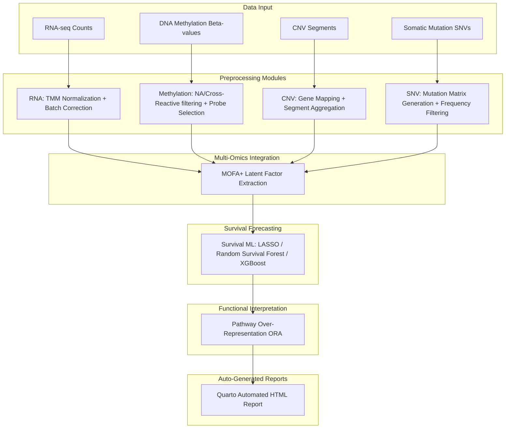

# OmicsFlow

[](https://nextflow.io/)
[](https://www.docker.com/)
[](https://quarto.org/)
[](LICENSE)

**OmicsFlow** is a modular, parameterizable, and reproducible orchestration pipeline designed for integrated multi-omics preprocessing, latent feature extraction, and downstream clinical survival forecasting. It seamlessly coordinates transcriptomics (RNA-seq), epigenomics (DNA Methylation), copy number variations (CNV), and somatic mutations (SNV), applying advanced Multi-Omics Factor Analysis (MOFA+) alongside machine learning survival models to predict clinical outcomes and isolate targetable biological pathways.

---

## 1. Project Overview

OmicsFlow bridges the gap between raw, heterogeneous biological data matrices and actionable clinical survival forecasting. Built as a collection of modular preprocessing, integration, and survival-modeling scripts, the workflow standardizes and integrates distinct cellular views, trains predictive machine learning models, performs functional over-representation analysis, and compiles all analytics into a dynamic, publication-grade interactive report.

---

## 2. Key Features

- **Universal Metadata Abstraction Layer:** Complete decoupled support for external cohorts. Supply a custom sample mapping file to seamlessly route mismatched samples without renaming raw inputs.
- **Realistic Cohort Validation System:** Generates highly realistic oncology cohorts complete with center batch effects and three distinct biological subtypes to test mathematical and structural pipeline integrity.
- **Multi-Omics Integration (MOFA+):** Compresses high-dimensional transcriptomic, epigenomic, copy number, and somatic mutation data into low-dimensional shared factor landscapes.
- **Survival Modeling & Biomarker Extraction:** Supports LASSO Cox Regression, Random Survival Forests, and XGBoost models to predict clinical outcomes from multi-omics components.
- **Automated HTML Reporting:** Quarto-driven compile engine generates a unified, interactive dashboard featuring Lightbox visualizations, Kaplan-Meier curves, and feature importance matrices.

---

## 3. Architecture Overview

The pipeline executes a sequentially dependent multi-omics workflow:



---

## 4. Quick Start (R Package API)

**Purpose:** Default user onboarding workflow.

### Interactive Onboarding Guide

Click here to open the fully interactive, browser-based HTML onboarding guide:

[Open RStudio Quickstart]([docs/rstudio_quickstart.html]([https://abdullah-i-ali.github.io/OmicsFlow/rstudio_quickstart.html](https://abdullah-i-ali.github.io/OmicsFlow/rstudio_quickstart.html)))

---

### Command Reference

The R package provides a highly usable abstraction layer to interact with the scientific pipeline directly from RStudio or any R environment. The core package is lightweight, keeping heavy analytical dependencies dynamically installed when requested.

```r
# Install the lightweight orchestration layer
install.packages("remotes")
remotes::install_github("Abdullah-I-Ali/OmicsFlow", ref = "feature/rstudio-usability")

library(OmicsFlow)

# Install required heavy scientific frameworks (MOFA2, XGBoost, clusterProfiler, etc.)
install_omicsflow_dependencies()

# 1. Generate metadata and clinical templates
generate_metadata_templates(
  rna = "data/mycohort/rna.rds",
  meth = "data/mycohort/meth.rds",
  output_dir = "results/templates"
)

# 2. (Optional) Review and edit the generated templates

# 3. Validate input integrity
validate_inputs(
  rna = "data/mycohort/rna.rds",
  meth = "data/mycohort/meth.rds",
  metadata = "results/templates/sample_metadata.csv",
  clinical = "results/templates/custom_clinical_template.tsv",
  clinical_map = "results/templates/clinical_map.json"
)

# 4. Execute the full pipeline
omicsflow(
  rna = "data/mycohort/rna.rds",
  meth = "data/mycohort/meth.rds",
  metadata = "results/templates/sample_metadata.csv",
  clinical = "results/templates/custom_clinical_template.tsv",
  clinical_map = "results/templates/clinical_map.json",
  outdir = "results/myrun"
)
```

---

## 5. HPC / Reproducibility (Nextflow)

**Purpose:** High-Performance Computing (HPC) / scalability / reproducibility workflow.

For massive parallelization across clusters or clouds, or strictly reproducible containerized execution, utilize the Nextflow CLI:

1. Install [Docker Desktop](https://www.docker.com/) (enable WSL2 on Windows).
2. Install [Nextflow](https://nextflow.io/) (>= 22.10.0).
3. Install [Quarto](https://quarto.org/) and ensure it is accessible in your system `PATH`.

```bash
# Clone the repository
git clone https://github.com/Abdullah-I-Ali/OmicsFlow.git
cd OmicsFlow

# Pull or build execution containers
docker build -t omicsflow:latest .

# Run the pipeline
nextflow run main.nf \
  --rna data/mycohort/rna.rds \
  --meth data/mycohort/meth.rds \
  --cnv data/mycohort/cnv.rds \
  --snv data/mycohort/snv.rds \
  --metadata data/mycohort/sample_metadata.csv \
  --clinical data/mycohort/custom_clinical.tsv \
  --clinical_map data/mycohort/clinical_map.json \
  --outdir results/myrun \
  -profile docker
```

---

## 6. Required Input Files

To run OmicsFlow on a custom cohort, compile the following input files:

| File | Description | Formats |
|---|---|---|
| `rna.rds` | Raw RNA-seq count matrix. | `.rds` / `.csv` |
| `meth.rds` | DNA methylation Beta-values matrix. | `.rds` / `.csv` |
| `cnv.rds` | Copy number segment definitions or gene-mapped score table. | `.rds` / `.csv` |
| `snv.rds` | Somatic mutation variant list or precompiled binary occurrence matrix. | `.rds` / `.csv` |
| `sample_metadata.csv` | Universal cross-modality sample-to-patient mapping. | `.csv` |
| `custom_clinical.tsv` | Clinical survival timeline, vital statuses, and covariates. | `.tsv` / `.csv` |
| `clinical_map.json` | Key-value mapping translating custom clinical headers to unified pipeline variables. | `.json` |

---

## 7. Input Format Specifications

Ensure input matrices align with these structural specifications:

### RNA-seq (`rna.rds`)
*   **Structure:** Matrix of dimensions $G$ (genes) $\times$ $S$ (RNA samples).
*   **Rownames:** Ensembl Gene IDs or Hugo Symbols (Feature IDs).
*   **Colnames:** Unique RNA sample IDs matching `sample_metadata.csv`.
*   **Values:** Raw, untransformed counts.

### DNA Methylation (`meth.rds`)
*   **Structure:** Matrix of dimensions $P$ (probes) $\times$ $S$ (Methylation samples).
*   **Rownames:** Illumina Infinium probe IDs (cg-numbers).
*   **Colnames:** Unique methylation sample IDs matching `sample_metadata.csv`.
*   **Values:** Beta-values ($0.0 \le \beta \le 1.0$) or M-values.

### Copy Number Variation (`cnv.rds`)
*   **Structure:** Standard segment data frames containing `Sample`, `Chromosome`, `Start`, `End`, `Num_Probes`, and `Segment_Mean` columns. Alternatively, pre-mapped gene-level score matrices.

### Somatic Mutations (`snv.rds`)
*   **Structure:** Tabular format mapping `Hugo_Symbol`, `Tumor_Sample_Barcode`, `Variant_Classification` (or precompiled binary $0/1$ gene-by-sample mutation grids).

---

## 8. Metadata & Clinical Mapping Examples

OmicsFlow uses an abstraction layer to decouple pipeline execution from sample-naming conventions. This allows you to process mismatched omics matrices without manual string slicing.

### Metadata Schema Example (`sample_metadata.csv`)
```csv
sample_id,patient_id,sample_class,batch,center
S_RNA_001,P_001,Tumor,B1,Center_Alpha
S_METH_001,P_001,Tumor,B2,Center_Alpha
S_RNA_002,P_002,Tumor,B1,Center_Beta
S_METH_002,P_002,Tumor,B1,Center_Beta
```
*   `sample_id`: Matches the column names of your respective omics data files.
*   `patient_id`: The patient identifier used to match and join different omics types.
*   `sample_class`: Phenotypic category (e.g., Tumor, Normal).
*   `batch` & `center`: Variables for batch-correction diagnostics.

### Clinical Mapping Schema (`clinical_map.json`)
```json
{
  "patient_id": "patient_barcode",
  "os_time": "overall_survival_days",
  "os_event": "vital_status_event",
  "age": "age_at_diagnosis",
  "gender": "biological_sex"
}
```
*The clinical mapping schema translates local column headers in your clinical TSV into unified variables utilized natively inside the survival models.*

---

## 9. Expected Outputs

Upon successful execution, all analytical outputs are systematically organized:

```text
results/myrun/
├── output_rna/              # Preprocessed & batch-corrected RNA expression matrices & density plots
├── output_meth/             # Probe-filtered DNA methylation Beta-value matrices & probe logs
├── output_cnv/              # Gene-mapped Copy Number score tables & PCA diagnostic plots
├── output_snv/              # Clean mutation matrices & somatic variant frequency tables
├── output_integration/      # Trained MOFA+ model, latent weights, & variance explained metrics
├── output_ml/               # Survival models (LASSO, RSF), KM curves, & biomarker importances
├── output_enrichment/       # Functional GO/KEGG pathway lists, network plots (cnetplot), & maps
└── reports/
    └── OmicsFlow_Report.html # Final dynamic HTML report compiled by Quarto
```

---

## 10. Realistic Validation Framework

The realistic validation framework operates as a ground-truth simulator to evaluate mathematical stability and recovery. You can run it via `Rscript run_realistic_validation.R`.

### The Biological Subtypes
The synthetic engine constructs $150-200$ patients divided across three biologically inspired profiles:
1. **Proliferative (Subtype A):** Extreme Cell Cycle acceleration and high copy number variations. Characterized by a poor prognosis.
2. **Stromal/Mesenchymal (Subtype B):** Driven by Extracellular Matrix (ECM) organization pathways and distinct methylation silences. Characterized by an intermediate prognosis.
3. **Immune Inflamed (Subtype C):** Prominent Immune Response pathway activation and high somatic mutation burdens. Characterized by a favorable prognosis.

---

## 11. Runtime, Resource, & Scenario Specifications

### Resource Expectations
- **Minimum:** 4 Cores, 8 GB RAM.
- **Recommended:** 8 Cores, 16 GB+ RAM.
- **Expected Runtime (Standard Demo):** ~5–12 minutes depending on hardware.

### Scope & Constraints
- **Human-Focused:** Pathway databases, gene coordinate mappings, and annotation libraries utilize human definitions (hg38/GRCh38).
- **Illumina Mappings:** Preprocessing handles standard Illumina HumanMethylation450k and MethylationEPIC platforms.
- **Academic Validation:** Synthetic execution is for software and logic validation only. It is **not** a clinical diagnostic tool and must not be used for patient decision-making.

---

## 12. Common Pitfalls & Troubleshooting

- **Mismatched Sample IDs:** If the sample IDs in your `rna.rds` colnames do not precisely match the column entries in `sample_metadata.csv`, the preprocessing module will evaluate counts to `NULL` or drop the samples. Ensure case sensitivity and matching.
- **Missing Clinical Mapping Keys:** If R fails with variable selection errors, check that `clinical_map.json` maps *all* required fields (`patient_id`, `os_time`, `os_event`) to valid clinical TSV column headers.
- **Missing Quarto executable:** If the HTML report fails to compile, verify Quarto is correctly installed by running `quarto --version` in your terminal. Ensure the executable is in your environment paths.
- **Unsupported Methylation Arrays:** Probes not matching standard EPIC or 450k cg-prefixes may be dropped by probe filtering routines. Ensure input coordinates are aligned to mapped human probes.

---

## 13. Repository Structure

```text
OmicsFlow/
├── modules/                 # Modular preprocessing, ML, integration, and enrichment engines
├── reports/                 # Quarto reporting templates and final HTML compilations
├── tests/                   # Regression and unit test cases
├── data/                    # Storage for raw reference databases and synthetic cohorts
├── results/                 # Pipeline output destination directory
├── configs/                 # Gene annotation coordinates and array cross-reactive lists
├── run_realistic_validation.R # Orchestrator script for the realistic cohort demo
├── main.nf                  # Nextflow workflow definition
└── README.md                # System documentation
```

---

## 14. Roadmap

- [ ] **Pan-Cancer Benchmarking:** High-throughput validation across classic TCGA datasets.
- [ ] **Independent GEO Validation:** Support for microarrays and single-omics validation tests.
- [ ] **HPC & Cloud Deployment:** Configuration profiles for AWS Batch, SLURM, and Nextflow Tower.

---

## 15. Citation & Authors

**OmicsFlow: A Modular Pipeline for Integrated Multi-Omics and Survival Forecasting**  
**Author:** Abdullah Ibrahim Ali  
**Year:** 2026  
**Repository:** [https://github.com/Abdullah-I-Ali/omicsflow](https://github.com/Abdullah-I-Ali/omicsflow)  
