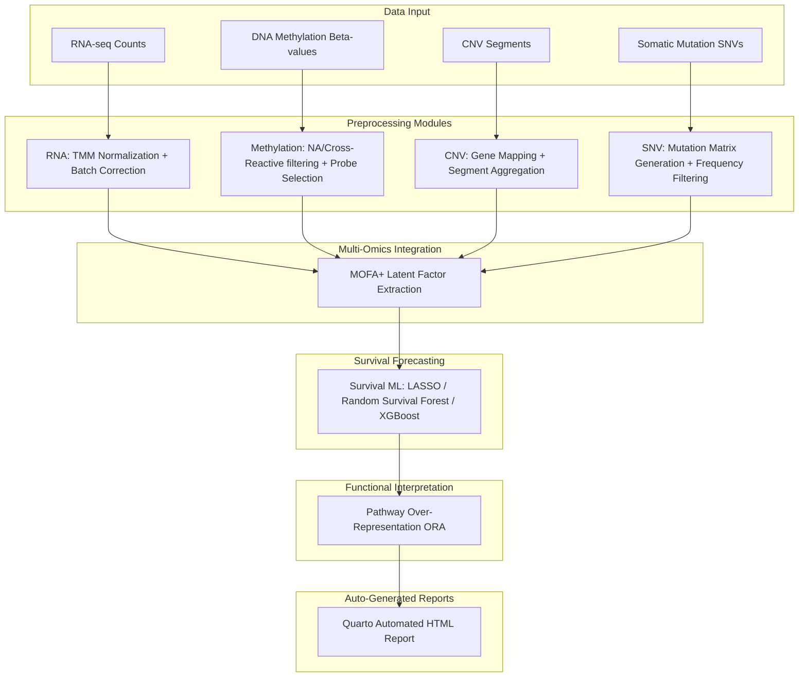

# OmicsFlow

[](https://nextflow.io/)
[](https://www.docker.com/)
[](https://quarto.org/)
[](LICENSE)

**OmicsFlow** is a modular, parameterizable, and reproducible orchestration pipeline designed for integrated multi-omics preprocessing, latent feature extraction, and downstream clinical survival forecasting. It seamlessly coordinates transcriptomics (RNA-seq), epigenomics (DNA Methylation), copy number variations (CNV), and somatic mutations (SNV), applying advanced Multi-Omics Factor Analysis (MOFA+) alongside machine learning survival models to predict clinical outcomes and isolate targetable biological pathways.

---

## 1. Project Overview

OmicsFlow bridges the gap between raw, heterogeneous biological data matrices and actionable clinical survival forecasting. Built as a collection of modular preprocessing, integration, and survival-modeling scripts, the workflow standardizes and integrates distinct cellular views, trains predictive machine learning models, performs functional over-representation analysis, and compiles all analytics into a dynamic, publication-grade interactive report.

---

## 2. Key Features

- **Universal Metadata & TCGA Fallback:** Complete decoupled support for external cohorts. Supply a custom sample mapping file to seamlessly route mismatched samples, or omit metadata entirely to trigger native TCGA barcode parsing and auto-detection.
- **Reproducibility & Validation:** Fully deterministic executions via strict seed control. Backed by an automated publication validation suite proving 100% identical outputs and missing-modality robustness.
- **Multi-Omics Integration (MOFA+):** Compresses high-dimensional transcriptomic, epigenomic, copy number, and somatic mutation data into low-dimensional shared factor landscapes.
- **Survival Modeling & Biomarker Extraction:** Supports LASSO Cox Regression, Random Survival Forests, and XGBoost models to predict clinical outcomes from multi-omics components.
- **Automated HTML Reporting:** Quarto-driven compile engine generates a unified, interactive dashboard featuring Lightbox visualizations, Kaplan-Meier curves, and feature importance matrices.

---

## 3. Architecture Overview

The pipeline executes a sequentially dependent multi-omics workflow:



---

## 4. Quick Start (R Package API)

**Purpose:** Default user onboarding workflow.

### Interactive Onboarding Guide

Click below to open the fully interactive, browser-based HTML onboarding guide:

[Open RStudio Quickstart](https://abdullah-i-ali.github.io/OmicsFlow/rstudio_quickstart.html)

---

### Command Reference

The R package provides a highly usable abstraction layer to interact with the scientific pipeline directly from RStudio or any R environment. The core package is lightweight, keeping heavy analytical dependencies dynamically installed when requested.

**Input Data Formats**:
*   **Recommended:** `.rds` (Native Support for `SummarizedExperiment` or Matrix objects)
*   **Supported:** `.csv`, `.tsv`, `.txt`

```r
# Install the lightweight orchestration layer
install.packages("remotes")
remotes::install_github("Abdullah-I-Ali/OmicsFlow", ref = "main")

library(OmicsFlow)

# Install required heavy scientific frameworks (MOFA2, XGBoost, clusterProfiler, etc.)
install_omicsflow_dependencies()

# 1. Generate metadata and clinical templates
generate_metadata_templates(
  rna = "data/mycohort/rna.rds",
  meth = "data/mycohort/meth.rds",
  output_dir = "results/templates"
)

# 2. Validate input integrity
validate_inputs(
  rna = "data/mycohort/rna.rds",
  meth = "data/mycohort/meth.rds",
  metadata = "results/templates/sample_metadata.csv",
  clinical = "results/templates/custom_clinical_template.tsv",
  clinical_map = "results/templates/clinical_map.json"
)

# 3. Execute the full pipeline
omicsflow(
  rna = "data/mycohort/rna.rds",
  meth = "data/mycohort/meth.rds",
  metadata = "results/templates/sample_metadata.csv",
  clinical = "results/templates/custom_clinical_template.tsv",
  clinical_map = "results/templates/clinical_map.json",
  outdir = "results/myrun"
)
```

---

## 5. HPC / Reproducibility (Nextflow)

**Purpose:** High-Performance Computing (HPC) / scalability / reproducibility workflow.

For massive parallelization across clusters or clouds, or strictly reproducible containerized execution, utilize the Nextflow CLI:

1. Install [Docker Desktop](https://www.docker.com/) (enable WSL2 on Windows).
2. Install [Nextflow](https://nextflow.io/) (>= 22.10.0).
3. Install [Quarto](https://quarto.org/) and ensure it is accessible in your system `PATH`.

```bash
# Clone the repository
git clone https://github.com/Abdullah-I-Ali/OmicsFlow.git
cd OmicsFlow

# Pull or build execution containers
docker build -t omicsflow:latest .

# Run the pipeline reproducibly
nextflow run main.nf \
  --rna data/mycohort/rna.rds \
  --meth data/mycohort/meth.rds \
  --cnv data/mycohort/cnv.rds \
  --snv data/mycohort/snv.rds \
  --metadata data/mycohort/sample_metadata.csv \
  --clinical data/mycohort/custom_clinical.tsv \
  --clinical_map data/mycohort/clinical_map.json \
  --outdir results/myrun \
  --seed 42 \
  -profile docker
```

---

## 6. Required Input Files

To run OmicsFlow on a custom cohort, compile the following input files:

| File | Description | Formats |
|---|---|---|
| `rna.rds` | Raw RNA-seq count matrix or `SummarizedExperiment`. | `.rds` / `.csv` |
| `meth.rds` | DNA methylation Beta-values matrix or `SummarizedExperiment`. | `.rds` / `.csv` |
| `cnv.rds` | Copy number segment definitions or gene-mapped score table. | `.rds` / `.csv` |
| `gene_coords.rds` | Ensembl CNV cache. Automatically bundled, or regenerated via `generate_cnv_cache()`. | `.rds` |
| `snv.rds` | Somatic mutation variant list or precompiled binary occurrence matrix. | `.rds` / `.csv` |
| `sample_metadata.csv` | Universal cross-modality sample-to-patient mapping. | `.csv` |
| `custom_clinical.tsv` | Clinical survival timeline, vital statuses, and covariates. | `.tsv` / `.csv` |
| `clinical_map.json` | Key-value mapping translating custom clinical headers to unified pipeline variables. | `.json` |

---

## 7. Metadata, Clinical Auto-Detection, & TCGA Fallback

OmicsFlow uses an elegant tiered abstraction layer for handling clinical data and metadata mapping.

### Tier 1: Explicit Mapping (Recommended for Custom Cohorts)
You supply `sample_metadata.csv` (mapping matrix samples to unique patients) and `clinical_map.json` (translating your local clinical headers to OmicsFlow native variables like `os_time`, `age`, `gender`).

### Tier 2: Auto-Detection
If you omit the `clinical_map.json` but provide a `custom_clinical.tsv`, OmicsFlow runs an NLP-like column detector to automatically map columns representing Survival Time, Event Status, Age, Gender, and Stage.

### Tier 3: TCGA Fallback (Generic Support)
If you **omit metadata and clinical tables entirely**, OmicsFlow relies on native parsing:
- If column names match TCGA formats (`TCGA-XX-XXXX-01...`), it extracts patient IDs, tumor types, and plate batches automatically.
- If column names are custom (`PT-1234`), it assigns a generic batch ("batch1") and retains all samples safely, guaranteeing that preprocessing executes gracefully without manual intervention.

---

## 8. CNV Cache Generation

The CNV preprocessing module requires an Ensembl gene coordinate cache to map genomic segments to genes. Because querying the Ensembl `biomaRt` API takes 1-3 minutes and is prone to network timeouts, **OmicsFlow comes bundled with a default fallback cache**.

If you wish to download a real, up-to-date hg38 gene coordinate cache for production use:
```r
generate_cnv_cache("my_gene_coords_hg38.rds")
```
You can then pass this cache explicitly: `omicsflow(..., cnv_cache = "my_gene_coords_hg38.rds")` or `validate_inputs(..., cnv_cache = "my_gene_coords_hg38.rds")`. If no cache is provided, OmicsFlow will automatically use the bundled default.

---

## 9. Methylation Cross-Reactive Probes

The Methylation preprocessing module automatically removes cross-reactive probes (which map to multiple genomic locations) using the Chen et al. (2013) list. **OmicsFlow comes bundled with a default fallback list** to ensure the pipeline runs offline without internet dependency.

You can override this by explicitly passing your own list:
`omicsflow(..., meth_cross_react = "my_cross_reactive_probes.csv")`

---

## 10. Reproducibility & Publication Validation

OmicsFlow enforces strict random number generation (RNG) control to ensure that latent features, ML survival estimators, and batch correction outputs are publication-grade. 

Passing `--seed` (or supplying `seed = 42` to your execution wrapper) guarantees 100% reproducible outputs down to identical matrix MD5 hashes.

**Validate your installation:**
You can run the fully automated publication validation suite to test identical-seed reproducibility, cross-seed stability, missing-modality robustness, and external TCGA performance on your system:
```bash
Rscript tests/run_publication_validation.R
```

---

## 11. Expected Outputs

Upon successful execution, all analytical outputs are systematically organized:

```text
results/myrun/
├── output_rna/              # Preprocessed & batch-corrected RNA expression matrices & density plots
├── output_meth/             # Probe-filtered DNA methylation Beta-value matrices & probe logs
├── output_cnv/              # Gene-mapped Copy Number score tables & PCA diagnostic plots
├── output_snv/              # Clean mutation matrices & somatic variant frequency tables
├── output_integration/      # Trained MOFA+ model, latent weights, & variance explained metrics
├── output_ml/               # Survival models (LASSO, RSF), KM curves, & biomarker importances
├── output_enrichment/       # Functional GO/KEGG pathway lists, network plots (cnetplot), & maps
└── reports/
    └── OmicsFlow_Report.html # Final dynamic HTML report compiled by Quarto
```

---

## 12. Realistic Validation Framework

The realistic validation framework operates as a ground-truth simulator to evaluate mathematical stability and recovery. You can run it via `Rscript run_realistic_validation.R`.

### The Biological Subtypes
The synthetic engine constructs $150-200$ patients divided across three biologically inspired profiles:
1. **Proliferative (Subtype A):** Extreme Cell Cycle acceleration and high copy number variations. Characterized by a poor prognosis.
2. **Stromal/Mesenchymal (Subtype B):** Driven by Extracellular Matrix (ECM) organization pathways and distinct methylation silences. Characterized by an intermediate prognosis.
3. **Immune Inflamed (Subtype C):** Prominent Immune Response pathway activation and high somatic mutation burdens. Characterized by a favorable prognosis.

---

## 13. Runtime, Resource, & Scenario Specifications

### Resource Expectations
- **Minimum:** 4 Cores, 8 GB RAM.
- **Recommended:** 8 Cores, 16 GB+ RAM.
- **Expected Runtime:** Highly optimized. A standard 4-modality cohort ($n=200$) processes in under **2-3 minutes** on modern hardware.

### Scope & Constraints
- **Human-Focused:** Pathway databases, gene coordinate mappings, and annotation libraries utilize human definitions (hg38/GRCh38).
- **Illumina Mappings:** Preprocessing handles standard Illumina HumanMethylation450k and MethylationEPIC platforms.

---

## 14. Common Pitfalls & Troubleshooting

- **Mismatched Sample IDs:** If the sample IDs in your `rna.rds` colnames do not precisely match the column entries in `sample_metadata.csv`, the preprocessing module will evaluate counts to `NULL` or drop the samples. Ensure case sensitivity and matching.
- **Missing Clinical Mapping Keys:** If R fails with variable selection errors, check that `clinical_map.json` maps *all* required fields (`patient_id`, `os_time`, `os_event`) to valid clinical TSV column headers. Alternatively, delete the JSON to rely on OmicsFlow's auto-detect logic.
- **Missing Quarto executable:** If the HTML report fails to compile, verify Quarto is correctly installed by running `quarto --version` in your terminal. Ensure the executable is in your environment paths.
- **Unsupported Methylation Arrays:** Probes not matching standard EPIC or 450k cg-prefixes may be dropped by probe filtering routines. Ensure input coordinates are aligned to mapped human probes.

---

## 15. Repository Structure

```text
OmicsFlow/
├── modules/                 # Modular preprocessing, ML, integration, and enrichment engines
├── R/                       # Core orchestration wrappers and metadata ingestion logic
├── reports/                 # Quarto reporting templates and final HTML compilations
├── tests/                   # Publication-grade validation and robustness suite
├── data/                    # Storage for raw reference databases and synthetic cohorts
├── results/                 # Pipeline output destination directory
├── configs/                 # Gene annotation coordinates and array cross-reactive lists
├── run_realistic_validation.R # Orchestrator script for the realistic cohort demo
├── main.nf                  # Nextflow workflow definition
└── README.md                # System documentation
```

---

## 16. Citation & Authors

**OmicsFlow: A Modular Pipeline for Integrated Multi-Omics and Survival Forecasting**  
**Author:** Abdullah Ibrahim Ali  
**Year:** 2026  
**Repository:** [https://github.com/Abdullah-I-Ali/omicsflow](https://github.com/Abdullah-I-Ali/omicsflow)  
