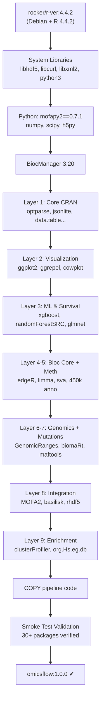

# OmicsFlow — Docker & Reproducibility Architecture

## Quick Start

```bash
# 1. Build the container
docker build -t omicsflow:1.0.0 .

# 2. Run full pipeline via Nextflow + Docker
nextflow run main.nf -profile docker \
  --rna         data/rna_expression_raw.rds \
  --meth        data/methylation_beta_raw.rds \
  --cnv         data/cnv_segment_raw.rds \
  --snv         data/snv_mutation_raw.rds \
  --clinical    data/clinical_data.tsv \
  --cross_react data/Chen_2013_cross_reactive_probes.csv \
  --gene_coords data/gene_coords_hg38.rds

# 3. Run a single module standalone
docker run --rm \
  -v $(pwd)/data:/omicsflow/data \
  -v $(pwd)/results:/omicsflow/results \
  omicsflow:1.0.0 \
  modules/rna/preprocess_rna.R --input data/rna_expression_raw.rds --outdir results/rna/
```

---

## Generated Files

| File | Size | Purpose |
|------|------|---------|
| `Dockerfile` | 5.8 KB | Multi-layer production image |
| `.dockerignore` | 759 B | Build context exclusions |
| `docker/smoke_test.R` | 3.6 KB | Build-time package validation |
| `envs/omicsflow.yml` | 2.4 KB | Pinned conda environment |

---

## Dockerfile Architecture



> [!IMPORTANT]
> The 9-layer package installation strategy maximizes Docker cache efficiency. Changing an enrichment package only rebuilds Layer 9, not the entire image.

---

## Pinned Environment Versions

| Component | Version | Rationale |
|-----------|---------|-----------|
| **R** | 4.4.2 | Matches development/testing environment |
| **Bioconductor** | 3.20 | Official release train for R 4.4.x |
| **mofapy2** | 0.7.1 | MOFA2 Python backend (exact pin) |
| **xgboost** | ≥2.0.0 | `survival:cox` objective stability |
| **randomForestSRC** | ≥3.2.2 | `predict.rfsrc` API stability |
| **glmnet** | ≥4.1-8 | Cox family support |
| **MOFA2** | ≥1.16.0 | Bioconductor 3.20 release |

---

## Smoke Test Coverage

The `docker/smoke_test.R` script runs automatically during `docker build` and validates:

| Category | Packages Checked |
|----------|-----------------|
| CRAN Core | optparse, jsonlite, data.table, matrixStats, stringr, dplyr, tidyr, tibble, scales, RColorBrewer, pheatmap |
| CRAN Visualization | ggplot2 |
| CRAN ML | survival, caret, glmnet, xgboost, randomForestSRC |
| Bioc Genomics | SummarizedExperiment, edgeR, limma, sva, impute, GenomicRanges, IRanges, GenomeInfoDb, biomaRt |
| Bioc Methylation | IlluminaHumanMethylation450kanno.ilmn12.hg19 |
| Bioc Mutations | maftools |
| Bioc Integration | MOFA2, reticulate, rhdf5 |
| Bioc Enrichment | clusterProfiler, org.Hs.eg.db, enrichplot, DOSE, AnnotationDbi |
| Python | mofapy2 |

> [!CAUTION]
> If **any** package fails to load, the Docker build aborts with exit code 1. This prevents shipping broken images.

---

## Nextflow Execution Profiles

| Profile | Command | Use Case |
|---------|---------|----------|
| `docker` | `nextflow run main.nf -profile docker` | Local machine with Docker |
| `singularity` | `nextflow run main.nf -profile singularity` | HPC without Docker daemon |
| `docker_slurm` | `nextflow run main.nf -profile docker_slurm` | SLURM cluster + Docker |
| `singularity_slurm` | `nextflow run main.nf -profile singularity_slurm` | SLURM cluster + Singularity |
| `conda` | `nextflow run main.nf -profile conda` | Conda-based (no container) |
| `standard` | `nextflow run main.nf` | Local, no container |
| `test` | `nextflow run main.nf -profile test` | CI/CD with reduced resources |

Profiles can be combined: `nextflow run main.nf -profile test,docker`

---

## Build & Validation Commands

```bash
# Build image
docker build -t omicsflow:1.0.0 .

# Verify smoke test passed (check build output for "ALL PACKAGES VERIFIED")

# Manual smoke test inside running container
docker run --rm omicsflow:1.0.0 /omicsflow/docker/smoke_test.R

# Check image size
docker images omicsflow:1.0.0

# Tag for registry push
docker tag omicsflow:1.0.0 ghcr.io/omicsflow/omicsflow:1.0.0
docker push ghcr.io/omicsflow/omicsflow:1.0.0

# Convert to Singularity (for HPC)
singularity pull omicsflow_1.0.0.sif docker://omicsflow:1.0.0
```

---

## Complete Project Structure (Post-Containerization)

```
omicsflow/
├── main.nf                     # Nextflow entry point
├── nextflow.config             # Master config (8 profiles)
├── Dockerfile                  # Production container
├── .dockerignore               # Build exclusions
├── configs/
│   └── omicsflow.config        # Scientific parameter defaults
├── envs/
│   └── omicsflow.yml           # Pinned conda environment
├── docker/
│   └── smoke_test.R            # Build-time validation
├── assets/
│   ├── NO_FILE_CLINICAL        # Nextflow optional input placeholder
│   ├── NO_FILE_CROSSREACT
│   └── NO_FILE_CACHE
├── modules_nf/                 # Nextflow process definitions
│   ├── preprocess_rna.nf
│   ├── preprocess_meth.nf
│   ├── preprocess_cnv.nf
│   ├── preprocess_snv.nf
│   ├── run_integration.nf
│   ├── run_ml.nf
│   └── run_enrichment.nf
├── modules/                    # R scientific modules (frozen)
│   ├── rna/
│   ├── methylation/
│   ├── cnv/
│   ├── snv/
│   ├── integration/
│   ├── ml/
│   └── enrichment/
├── tests/                      # Validation test suites
│   ├── test_rna.R
│   ├── test_meth.R
│   ├── test_cnv.R
│   ├── test_snv.R
│   ├── test_integration.R
│   ├── test_ml.R
│   └── test_enrichment.R
└── data/                       # Input data (mounted, never baked)
```
