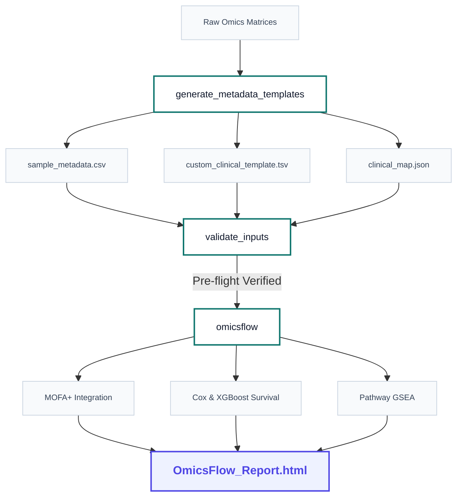

::: {.hero-section}
<div class="hero-title">OmicsFlow</div>
<div class="hero-subtitle">Dynamic Multi-Omics Analysis & Survival Forecasting Framework for R & Nextflow</div>
<p class="hero-desc">
  OmicsFlow orchestrates multi-omics alignment, factor integration via MOFA+, machine learning survival modeling, and pathway enrichment under a highly cohesive, programmatic R interface.
</p>
<div class="badge-container">
  <span class="badge-item primary">R Package v1.0.0</span>
  <span class="badge-item accent">Nextflow Engine</span>
  <span class="badge-item">MOFA+ Integration</span>
  <span class="badge-item">ML Survival Models</span>
  <span class="badge-item">Interactive Dashboards</span>
</div>
:::

## Introduction

Welcome to **OmicsFlow**! The platform is now fully installable as an **R package**, allowing you to execute complete multi-omics integration and survival forecasting workflows natively from RStudio or any R environment.

This quickstart guides you through the high-usability programmatic layer designed for rapid data exploration. For large-scale HPC execution, containerized parallelization, or strict clinical workflow audits, the Nextflow command-line interface remains fully supported as our high-performance infrastructure layer.

---

### Core Data & Execution Flow

Below is the conceptual architecture of the OmicsFlow R workflow. It highlights how files flow from raw omics matrices into metadata validation, core execution, and finally compile into the publication-ready dashboard.



---

::: {.workflow-step}
## <span class="step-num">1</span> Installation

Install the lightweight orchestration package directly from GitHub inside your R session:

```r
# Install remotes if missing
if (!requireNamespace("remotes", quietly = TRUE)) {
    install.packages("remotes")
}

# Install OmicsFlow from the release branch
remotes::install_github(
    "Abdullah-I-Ali/OmicsFlow",
    ref = "main"
)
```
:::

::: {.workflow-step}
## <span class="step-num">2</span> Load the Package

Load the library to register the namespace and functions:

```r
library(OmicsFlow)
```
:::

::: {.workflow-step}
## <span class="step-num">3</span> Install Scientific Dependencies

The core OmicsFlow package is intentionally kept lightweight. Heavy scientific frameworks (such as `MOFA2`, `xgboost`, `edgeR`, and `clusterProfiler`) are dynamically installed and managed.

Run the helper command to install all scientific backends:

```r
install_omicsflow_dependencies()
```

::: {.callout-tip title="Smart Skipping"}
The dependency manager will actively inspect your environment and skip any CRAN or Bioconductor packages that are already installed, ensuring a fast setup time.
:::
:::

::: {.workflow-step}
## <span class="step-num">4</span> Generate Metadata Templates

OmicsFlow uses an elegant metadata mapping system that eliminates the need to manually align IDs or rename matrix columns.

**Native SummarizedExperiment Support:** OmicsFlow natively supports `.rds` files containing `SummarizedExperiment` objects (such as TCGAbiolinks outputs). It will automatically extract assays and colData.
**Supported Input Formats:** `.rds` (recommended), `.csv`, `.tsv`, `.txt`

Generate template configuration structures based on your input matrices:

```r
generate_metadata_templates(
    rna      = "data/mycohort/rna_counts.rds",
    meth     = "data/mycohort/meth_beta.csv",
    cnv      = "data/mycohort/cnv_segments.tsv",
    snv      = "data/mycohort/snv_maf.txt",
    output_dir = "templates"
)
```

::: {.callout-note title="Missing Metadata & TCGA Fallback"}
If you are analyzing TCGA data directly or do not wish to perform batch correction, **you do not need to populate the templates**. OmicsFlow will automatically detect TCGA barcodes (`TCGA-XX-XXXX...`), extract batches, and map IDs without explicit templates. If barcodes are custom, it assigns generic batches safely.
:::

:::
::: {.workflow-step}
## <span class="step-num">5</span> Validate Inputs

Verify that your physical files exist, patient links match perfectly, and mapping schemas are scientifically consistent:

```r
validation <- validate_inputs(
    rna = "data/mycohort/rna.rds",
    meth = "data/mycohort/meth.rds",
    metadata = "templates/sample_metadata.csv"
)
```
:::

::: {.workflow-step}
## <span class="step-num">6</span> Run OmicsFlow Pipeline

Launch the entire pipeline — including normalization, multi-omics factor alignment, survival predictive modeling, pathway scoring, and automated markdown compilation — using a single command:

```r
results <- omicsflow(
    rna          = "data/mycohort/rna_counts.rds",
    meth         = "data/mycohort/meth_beta.csv",
    metadata     = "templates/sample_metadata.csv",
    clinical     = "templates/custom_clinical_template.tsv",
    clinical_map = "templates/clinical_map.json",
    outdir       = "results/myrun"
)
```

::: {.callout-tip title="Clinical Auto-Detection"}
You can simply provide your custom clinical TSV/CSV and **omit** `clinical_map.json`. OmicsFlow will employ heuristic natural language detection to map local column headers containing keywords like `age`, `survival`, `os_time`, `gender`, or `stage` automatically!
:::

::: {.expected-output}
<div class="expected-output-title">
  <i class="bi bi-braces"></i> Execution Structured S3 Object Output
</div>
```r
# Returned S3 Object (class: omicsflow_result)
list(
    status              = "success",
    report_path         = "results/myrun/reports/OmicsFlow_Report.html",
    output_dirs         = list(
        data            = "results/myrun/data",
        mofa            = "results/myrun/mofa",
        survival        = "results/myrun/survival",
        enrichment      = "results/myrun/enrichment",
        reports         = "results/myrun/reports"
      ),
    executed_modalities = c("rna", "meth"),
    skipped_modalities  = c("cnv", "snv"),
    warnings            = character(0),
    runtime             = "34.2 secs"
)
```
:::
:::

::: {.workflow-step}
## <span class="step-num">7</span> Open HTML Report

If `render_report = TRUE` (default), OmicsFlow compiles an interactive, presentation-ready dashboard summarizing your biological insights.

Locate your files inside the output folder structure:

::: {.expected-output}
<div class="expected-output-title">
  <i class="bi bi-folder2-open"></i> Results Directory Structure
</div>
```text
results/myrun/
├── data/                  # Preprocessed, aligned expression/epigenetic matrices
├── mofa/                  # Model outputs, weights, and factor variance statistics
├── survival/              # Kaplan-Meier curves, Cox models, and XGBoost predictors
├── enrichment/            # Pathway and functional gene set scoring models
└── reports/
    └── OmicsFlow_Report.html   # Final self-contained Interactive Dashboard
```
:::

The comprehensive dashboard contains:
* **Preprocessing QC**: PCA projections and variance plots per modality.
* **MOFA+ Latent Factors**: Visualizations of variance explained and feature weights.
* **Machine Learning Survival**: KM curves and Cox risk estimators.
* **Pathway Networks**: Visual interaction maps for key pathways.
:::

---

## Modality Flexibility

OmicsFlow is fundamentally built to support **any dynamic combination of $\ge 2$ omics views**. 

The integration engine requires at least two modalities to compute shared latent factors. If a modality is omitted or passed as `NULL`, OmicsFlow handles it gracefully and configures downstream steps automatically.

### Supported Combinations Include:
* **Transcriptomics & Epigenomics:** `rna` + `meth`
* **Transcriptomics & Genomics:** `rna` + `snv`
* **Epigenomics, CNV, & Genomics:** `meth` + `cnv` + `snv`
* **Full Multi-Omics:** `rna` + `meth` + `cnv` + `snv`

---

## Validating Your Installation

OmicsFlow bundles a complete publication-grade validation suite to verify exactly reproducible outputs on your system. Run this to ensure all packages and algorithms compute correctly:
```bash
Rscript tests/run_publication_validation.R
```

---

## Troubleshooting & Best Practices

### Scientific Dependency Failures
If package updates or compiler toolchains cause missing package warnings at execution, re-run the dependency manager to align package namespaces:
```r
install_omicsflow_dependencies()
```

### Python Backend & MOFA2 Setup
The core `MOFA2` package depends on a Python runtime. If you encounter initialization issues, run:
```r
reticulate::install_miniconda()
reticulate::py_install("mofapy2", pip = TRUE)
```

### Windows File Paths
Ensure all paths passed to OmicsFlow functions use forward slashes (`/`) or fully-escaped backslashes (`\\`). Avoid single unescaped backslashes.

### Clinical & Containerized Scalability
If your local Windows workstation lacks necessary compilation toolchains for complex scientific libraries, consider using **WSL2 (Windows Subsystem for Linux)** or execution via the **Docker/Nextflow** engine detailed in the main package README.
