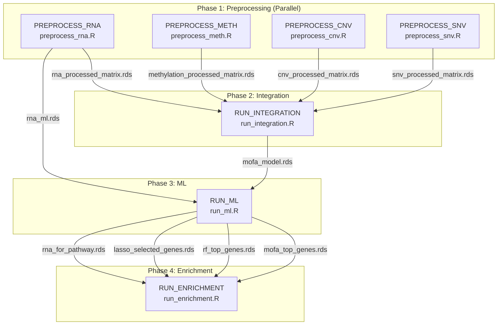

# OmicsFlow — Nextflow Orchestration Architecture

## Pipeline Execution Command

```bash
# Full pipeline (all 4 omics)
nextflow run main.nf \
  --rna         data/rna_expression_raw.rds \
  --meth        data/methylation_beta_raw.rds \
  --cnv         data/cnv_segment_raw.rds \
  --snv         data/snv_mutation_raw.rds \
  --clinical    data/clinical_data.tsv \
  --cross_react data/Chen_2013_cross_reactive_probes.csv \
  --gene_coords data/gene_coords_hg38.rds

# Resume after failure
nextflow run main.nf -resume

# With SLURM cluster
nextflow run main.nf -profile slurm --rna ... --meth ... --cnv ... --snv ...

# With conda environment
nextflow run main.nf -profile conda --rna ... --meth ... --cnv ... --snv ...
```

---

## Generated Files

| File | Purpose |
|------|---------|
| `main.nf` | Main workflow entry point — validation, parallel preprocessing, sequential downstream |
| `nextflow.config` | Master config — resources, profiles, reporting, manifest |
| `configs/omicsflow.config` | Module-specific scientific parameter defaults |
| `modules_nf/preprocess_rna.nf` | Nextflow process wrapping `preprocess_rna.R` |
| `modules_nf/preprocess_meth.nf` | Nextflow process wrapping `preprocess_meth.R` |
| `modules_nf/preprocess_cnv.nf` | Nextflow process wrapping `preprocess_cnv.R` |
| `modules_nf/preprocess_snv.nf` | Nextflow process wrapping `preprocess_snv.R` |
| `modules_nf/run_integration.nf` | Nextflow process wrapping `run_integration.R` |
| `modules_nf/run_ml.nf` | Nextflow process wrapping `run_ml.R` |
| `modules_nf/run_enrichment.nf` | Nextflow process wrapping `run_enrichment.R` |
| `envs/omicsflow.yml` | Conda environment with all R/Bioconductor dependencies |
| `assets/NO_FILE_*` | Placeholder files for optional Nextflow inputs |

---

## Pipeline DAG



---

## Data Flow & Channel Mapping

| Source Process | Output Channel | Destination Process | Input Channel |
|---|---|---|---|
| `PREPROCESS_RNA` | `processed_matrix` | `RUN_INTEGRATION` | `rna_matrix` |
| `PREPROCESS_RNA` | `ml_matrix` | `RUN_ML` | `rna_ml_matrix` |
| `PREPROCESS_METH` | `processed_matrix` | `RUN_INTEGRATION` | `meth_matrix` |
| `PREPROCESS_CNV` | `processed_matrix` | `RUN_INTEGRATION` | `cnv_matrix` |
| `PREPROCESS_SNV` | `processed_matrix` | `RUN_INTEGRATION` | `snv_matrix` |
| `RUN_INTEGRATION` | `mofa_model` | `RUN_ML` | `mofa_model` |
| `RUN_ML` | `mofa_top_genes` | `RUN_ENRICHMENT` | `mofa_top_genes` |
| `RUN_ML` | `rf_top_genes` | `RUN_ENRICHMENT` | `rf_top_genes` |
| `RUN_ML` | `lasso_genes` | `RUN_ENRICHMENT` | `lasso_genes` |
| `RUN_ML` | `rna_for_pathway` | `RUN_ENRICHMENT` | `rna_for_pathway` |

---

## Input Validation

The workflow validates at startup:

1. **Minimum omics**: At least 2 omics layers must be provided
2. **File existence**: All supplied input paths are verified
3. **Format check**: All omics inputs must be `.rds` format
4. **Full pipeline gate**: Integration → ML → Enrichment requires all 4 omics; partial inputs run preprocessing only

---

## Resource Profiles

| Label | CPUs | Memory | Time | Used By |
|-------|------|--------|------|---------|
| `process_low` | 2 | 4 GB | 1h | — |
| `process_medium` | 4 | 16 GB | 4h | CNV, SNV, Enrichment |
| `process_high` | 8 | 32 GB | 12h | RNA, Integration, ML |
| `process_high_memory` | 8 | 64 GB | 24h | Methylation |

## Execution Profiles

| Profile | Executor | Use Case |
|---------|----------|----------|
| `standard` | local | Development / single machine |
| `slurm` | SLURM | HPC cluster |
| `pbs` | PBS/Torque | HPC cluster |
| `conda` | local + conda | Reproducible environment |
| `test` | local (reduced) | CI/CD testing |

---

## Built-in Reporting

Nextflow auto-generates in `results/pipeline_info/`:

| File | Contents |
|------|----------|
| `timeline.html` | Visual execution timeline |
| `report.html` | Comprehensive execution report |
| `trace.txt` | Per-task resource usage (TSV) |
| `dag.html` | Interactive pipeline DAG |

---

## Production Features

- **Resume** (`-resume`): Cached work directories skip completed steps
- **Retries**: Failed processes retry up to 2 times automatically
- **Parallel execution**: All 4 preprocessing modules run simultaneously
- **Sequential gating**: Integration waits for all preprocessing; ML waits for integration; Enrichment waits for ML
- **publishDir**: Final outputs copied from work/ to organized `results/` tree
- **Partial mode**: Fewer than 4 omics → preprocessing only (with warning)

---

## Expected Output Directory Structure

```
results/
├── rna/                        # RNA preprocessing outputs
│   ├── rna_processed_matrix.rds
│   ├── rna_ml.rds
│   ├── qc_metrics.json
│   └── plots/
├── methylation/                # Methylation preprocessing outputs
│   ├── methylation_processed_matrix.rds
│   ├── qc_metrics.json
│   └── plots/
├── cnv/                        # CNV preprocessing outputs
│   ├── cnv_processed_matrix.rds
│   ├── qc_metrics.json
│   └── plots/
├── snv/                        # SNV preprocessing outputs
│   ├── snv_processed_matrix.rds
│   ├── qc_metrics.json
│   └── plots/
├── integration/                # MOFA+ integration outputs
│   ├── mofa_model.rds
│   ├── qc_metrics.json
│   └── plots/
├── ml/                         # ML survival analysis outputs
│   ├── ml_results_summary.csv
│   ├── rf_survival_model.rds
│   ├── xgb_cox_model.rds
│   ├── lasso_cox_model.rds
│   ├── mofa_top_genes.rds
│   ├── rf_top_genes.rds
│   ├── lasso_selected_genes.rds
│   ├── rna_for_pathway.rds
│   ├── qc_metrics.json
│   └── plots/
├── enrichment/                 # Pathway enrichment outputs
│   ├── enrichment_results.rds
│   ├── go_bp_results.csv
│   ├── kegg_results.csv
│   ├── qc_metrics.json
│   └── plots/
└── pipeline_info/              # Nextflow runtime reports
    ├── timeline.html
    ├── report.html
    ├── trace.txt
    └── dag.html
```
